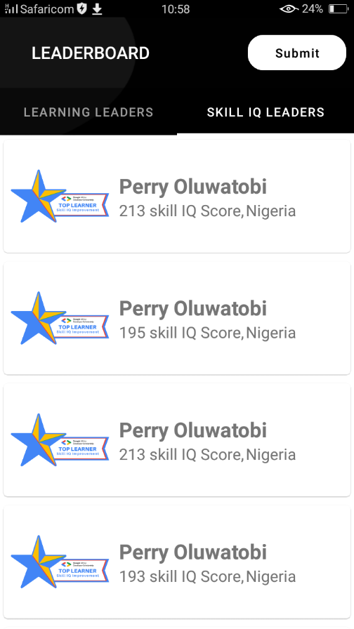

# GADS-Leaderboard-2020

# Development Environment
* The app is written in Kotlin and uses the Gradle build system.
* Min API level == 21  
* Android Studio >=4.1 RC 1 

# Architecture 

# Libraries
* [Android Jetpack](https://developer.android.com/jetpack)
   * [Data Binding](https://developer.android.com/topic/libraries/data-binding/) The Data Binding Library is a support library that allows you to bind UI components in your layouts to data sources in your app using a declarative format rather than programmatically.
   * [Live Data](https://developer.android.com/topic/libraries/architecture/livedata) LiveData is lifecycle-aware, meaning it respects the lifecycle of other app components updating app component observers that are in an active lifecycle state.
   * [Navigation](https://developer.android.com/guide/navigation/) Android Jetpack's Navigation component helps you implement effective navigation.
   * [Room](https://developer.android.com/topic/libraries/architecture/room) The Room persistence library provides an abstraction layer over SQLite to allow for more robust database access while harnessing the full power of SQLite.
* [Hilt](https://dagger.dev/hilt/) Hilt provides a standard way to incorporate Dagger dependency injection into an Android application.
* [Retrofit](https://square.github.io/retrofit/) Retrofit is the class through which your API interfaces are turned into callable objects. By default, Retrofit will give you sane defaults for your platform but it allows for customization.
* [Moshi](https://github.com/square/moshi/) Moshi is a great JSON library for Kotlin. It understands Kotlin’s non-nullable types and default parameter values. When you use Kotlin with Moshi you may use reflection, codegen, or both.
* [OkHTTP Interceptor](https://square.github.io/okhttp/interceptors/) Interceptors are a powerful mechanism that can monitor, rewrite, and retry calls. Here’s a simple interceptor that logs the outgoing request and the incoming response.
* [Flow](https://kotlin.github.io/kotlinx.coroutines/kotlinx-coroutines-core/kotlinx.coroutines.flow/-flow/) A cold asynchronous data stream that sequentially emits values and completes normally or with an exception.
* [Glide](https://github.com/bumptech/glide) Glide is a fast and efficient open source media management and image loading framework for Android that wraps media decoding, memory and disk caching, and resource pooling into a simple and easy to use interface.

# Screens
|
|
|
|
|
|
|
